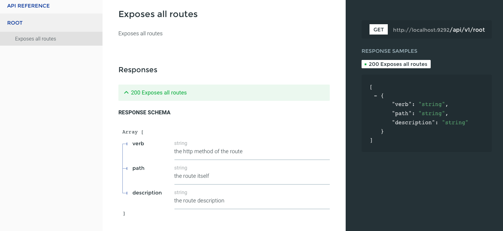

[](https://github.com/LeFnord/grape-starter/actions/workflows/pipeline.yml)
[](https://badge.fury.io/rb/grape-starter)

- [Why the next one?](#why-the-next-one)
- [Usage](#usage)
  - [Install it](#install-it)
  - [Create a new project](#create-a-new-project)
  - [Add resources](#add-resources)
  - [Import OAPI spec \[WIP\]](#import-oapi-spec-wip)
  - [Remove a resource](#remove-a-resource)
- [Contributing](#contributing)
  - [Adding a new ORM template](#adding-a-new-orm-template)
- [License](#license)


# Grape Starter

Is a tool to help you to build up a skeleton for a [Grape](http://github.com/ruby-grape/grape) API mounted on [Rack](https://github.com/rack/rack) ready to run.
[grape-swagger](http://github.com/ruby-grape/grape-swagger) would be used to generate a  [OAPI](https://github.com/OAI/OpenAPI-Specification/blob/master/versions/2.0.md) compatible documentation, which could be shown with [ReDoc](https://github.com/Rebilly/ReDoc).




## Why the next one?

- build up a playground for your ideas, prototypes, testing behaviour … whatever
- ~~no assumtions about~~ you can choose, if you want to use a backend/ORM, ergo no restrictions, only a pure grape/rack skeleton with a nice documentation


## Usage

### Install it
```
$ gem install grape-starter
```


### Create a new project
```
$ grape-starter new awesome_api
```
with following options:
```
-f, --force                # overwrites existend project
-p foobar, --prefix=foobar # sets the prefix of the API (default: none)
-o sequel, --orm=sequel    # create files for the specified ORM, available: sequel, activerecord (ar) (default: none)
```
This command creates a folder named `awesome_api` containing the skeleton. With following structure:
```
├── <Standards>
├── api
│   ├── base.rb        # the main API class, all other endpoints would be mounted in it
│   ├── endpoints      # contains the endpoint file for a resource
│   │   └── root.rb    # root is always available, it exposes all routes/endpoints, disable by comment it out in base.rb
│   └── entities       # contains the entity representation of the reource, if wanted
│       └── route.rb
├── config             # base configuration
│   └── …
├── config.ru          # Rack it up
├── lib                # contains the additional lib file for a resource
│   ├── models
│   │   └── version.rb
│   └── models.rb
├── public             # for serving static files
│   └── …
├── script             # setup / server / test etc.
│   └── …
└── spec               # RSpec
    └── …
```

… using `--orm` flag adds follwing files and directories to above project structure:
```
├── .config
├── config
│   …
│   ├── database.yml
│   └── initializers
│       └── database.rb
…
├── db
│   └── migrations
…
```

Don't forget to adapt the `config/database.yml` to your needs
and also to check the Gemfile for the right gems.

In `.config` the choosen ORM would be stored.

To run it, go into awesome_api folder, start the server
```
$ cd awesome_api
$ ./script/server *port
```
the API is now accessible under: [http://localhost:9292/api/v1/root](http://localhost:9292/api/v1/root)
the documentation of it under: [http://localhost:9292/doc](http://localhost:9292/doc).

More could be found in [README](template/README.md).


### Add resources
```
$ grape-starter add foo [http methods]
```
This adds endpoint and lib file and belonging specs, and a mount entry in base.rb.

Using it with following options:
```
-e, --entity    # a grape entity file will also be created
-m, --migration # adds also a migration file, if an ORM is used
-o, --orm       # sets the parent class of libe file (e.g: `Foo < Sequel::Model` for Sequel)
```
to add CRUD endpoints for resource foo. By given http methods only this one would be generated.
For available methods see: [`Templates::Endpoints`](https://github.com/LeFnord/grape-starter/blob/d7bb6c4946dc27fcafa5a75435b45bfe2b7277f0/lib/starter/builder/templates/endpoints.rb#L7-L26).

Example:
```
grape-starter add foo post get
```
will use `post` and `get_one` to create the `post` and `get` endpoint, it would be respected, if it is the singular or plural form of it, so the plural form would look like:
```
grape-starter add foos post get
```
this will use `post`, `get_all` and `get_specific` to create the `post`, `get` and `get :id` endpoints.

If the `orm` switch `true`, the lib class would be created as child class of a specific ORM class,
so for example for Sequel, it would be wirtten: `Foo < Sequel::Model` instead of `Foo`, hereby the using ORM would be taken from the configuration, which was stored by project creation.


### Import OAPI spec [WIP]
```
$ grape-starter import path/to/spec
```
to create an API based on the spec.

##### To Dos:

- [x] read spec an create per namespace a file with defined endpoint
- [x] read path parameter
  - [x] requires it in param block
  - [x] specify it
- [ ] handle query parameter -> check it
- [ ] handle body parameter -> check it


### Remove a resource
```
$ grape-starter rm foo
```
to remove previous generated files for a resource.


## Contributing

Any contributions are welcome on GitHub at https://github.com/LeFnord/grape-starter.


### Adding a new ORM template

To add an new ORM, it needs following steps:

1. A template class, with predefined methods …

  ```ruby
  module Starter
    module Templates
      module <YOUR NAME>
        def model_klass
          # the class, from which self inherit, e.g. 'Sequel::Model'
        end

        def initializer
          # provide your string
        end

        def config
          # provide your string
        end

        def rakefile
          # provide your string
        end

        def gemfile
          # provide your string
        end
      end
    end
  end
  ```

  see as example [sequel.rb](lib/starter/builder/templates/sequel.rb), there the return value of each method would be written into the
  corresponding file (see: [orms.rb](lib/starter/builder/orms.rb)).

2. An additional switch in the [`Starter::Orms.build`](https://github.com/LeFnord/grape-starter/blob/ef45133e6d2254efee06ae4f17ede2fc5c06bebb/lib/starter/builder/orms.rb#L7-L18) and [`Starter::Names.lib_klass_name`](https://github.com/LeFnord/grape-starter/blob/ef45133e6d2254efee06ae4f17ede2fc5c06bebb/lib/starter/builder/names.rb#L13-L24) methods to choose the right template.
3. An entry in the description of the [`new` command](https://github.com/LeFnord/grape-starter/blob/fa62c8a2ff72f984144b2336859d3e0b397398bd/bin/grape-starter#L28), when it would be called with `-h`


## License

The gem is available as open source under the terms of the [MIT License](LICENSE).
